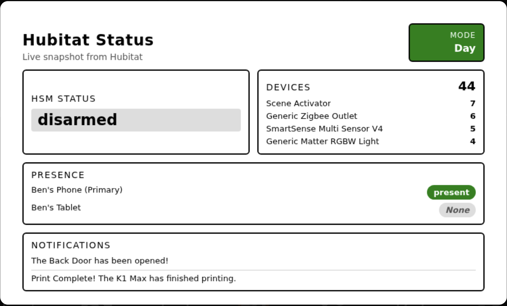
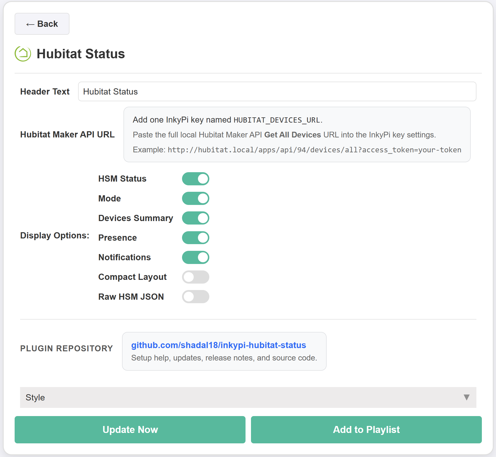

# InkyPi Hubitat Status

An InkyPi plugin that shows a Hubitat status with a clean, glanceable layout and configurable dashboard cards.

## Install

Use the InkyPi plugin installer with the plugin ID and this repository URL, following the install pattern shown by the official InkyPi plugin template.

```bash
inkypi plugin install hubitat_status https://github.com/shadal18/inkypi-hubitat-status
```

## Update

To update the plugin on your InkyPi device:

1. SSH into your InkyPi host.
2. Change into the plugin directory:
   ```bash
   cd ~/InkyPi/src/plugins/hubitat_status
   ```
3. Run this update command:
   ```bash
   git pull origin main && \
   if [ -d hubitat_status ]; then \
     rsync -a hubitat_status/ ./ && \
     rm -rf hubitat_status; \
   fi && \
   sudo systemctl restart inkypi.service
   ```

If you don’t see your changes after updating:

- Confirm you are in the correct plugin folder.
- Clear your browser cache or hard refresh the InkyPi web UI.
- Check the InkyPi logs for any plugin errors.

## Requirements

- A reachable Hubitat hub with Maker API enabled.
- A valid Hubitat Maker API access token.
- Network access from the InkyPi device to the Hubitat hub.

## Features

This plugin is an extension for the InkyPi e-paper display frame and includes the following features.

- Shows the current Hubitat mode.
- Shows the current Hubitat Safety Monitor status.
- Colors the mode card based on the active mode.
- Shows a device summary using the Hubitat devices API.
- Shows mobile presence status using devices with type `Mobile App Device`.
- Shows recent mobile app notifications in a dedicated card.
- Removes duplicate notification messages automatically.
- Clean layout optimized for quick glance reading on e-paper.
- Configurable dashboard cards so only the sections you want are shown.

## Settings

The plugin settings page lets you customize:

- Header title text.
- Show or hide the HSM status card.
- Show or hide the mode card.
- Show or hide the devices summary card.
- Show or hide the presence card.
- Show or hide the notifications card.
- Enable or disable compact layout.
- Show or hide raw HSM JSON.

## API Key Setup

This plugin requires a Hubitat Maker API access token.

### Create a Hubitat Maker API token

1. Open your Hubitat web interface.
2. Go to **Apps**.
3. Click **Add App** or **Add Built-In App**.
4. Choose **Maker API**.
5. Select the devices you want this plugin to access.
6. Click **Update**.
7. After saving, copy the local API information shown by Maker API.
8. Note your Hubitat hub IP address.
9. Copy the generated `access_token` from the Maker API URLs.

### Add the key in InkyPi

1. Open the InkyPi front page.
2. Click the **key icon**.
3. Add a new key named `HUBITAT_API_BASE`.
4. Set its value to your Hubitat local address, for example `http://192.168.20.9`.
5. Add another key named `HUBITAT_ACCESS_TOKEN`.
6. Paste in your Hubitat Maker API access token.
7. Save the keys.
8. Restart InkyPi if needed.

## API Endpoints Used

This plugin currently reads data from the following Hubitat Maker API endpoints:

- `/apps/api/94/modes`
- `/apps/api/94/hsm`
- `/apps/api/94/devices/all`

These are used to build the dashboard cards for mode, HSM, device summaries, mobile presence, and notification text.

## Repository

GitHub repository:

[https://github.com/shadal18/inkypi-hubitat-status](https://github.com/shadal18/inkypi-hubitat-status)

## Screenshots

- Main plugin display showing Hubitat status cards.
- Plugin settings screen.

<p align="center">
  
  
</p>
